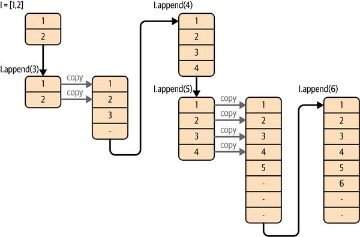

## Lists Versus Tuples
Tuples are cached by the Python runtime, which means that we don’t need to talk to the kernel to 
reserve memory every time we want to use one.

List allocation equation in Python 3.12.2
`M = (N + (N >> 3) + 6) & ~3`
As we append data, we utilize the extra space and increase the effective size of the list, N. 
As a result, N grows as we append new data, until N == M.
At this point, there is no extra space to insert new data into, 
and we must create a new list with more extra space. This new list has extra headroom as given by the equation.
We copy the old data into the new space. In using this method, 
Python generally overallocates about 12.5% of the list space in order to reduce the time of list appends. 
However, for small lists this can be much higher—for a list with 
1 item, 4 are allocated, and for 9 items, 16 are allocated!

